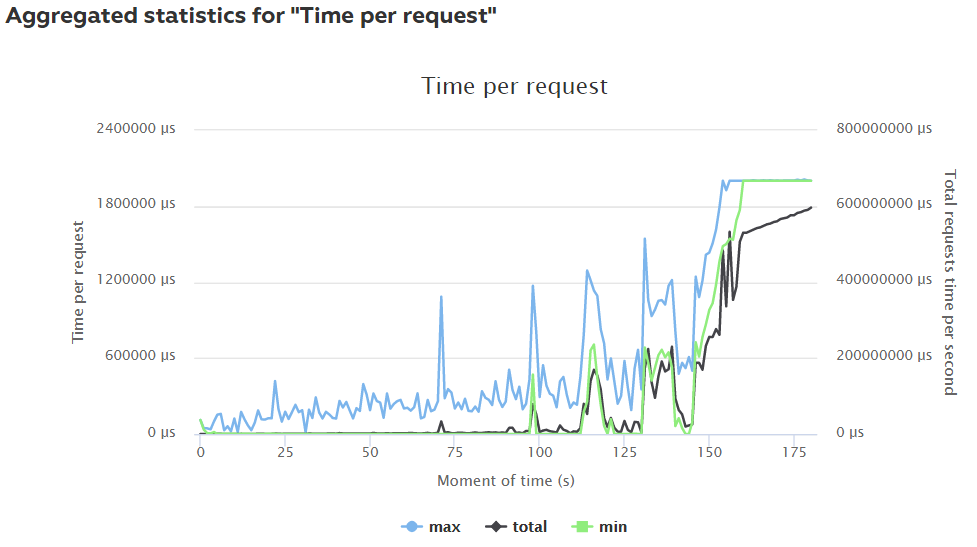
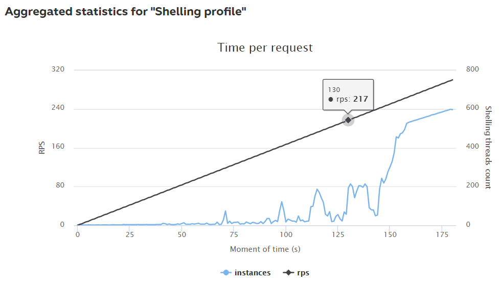
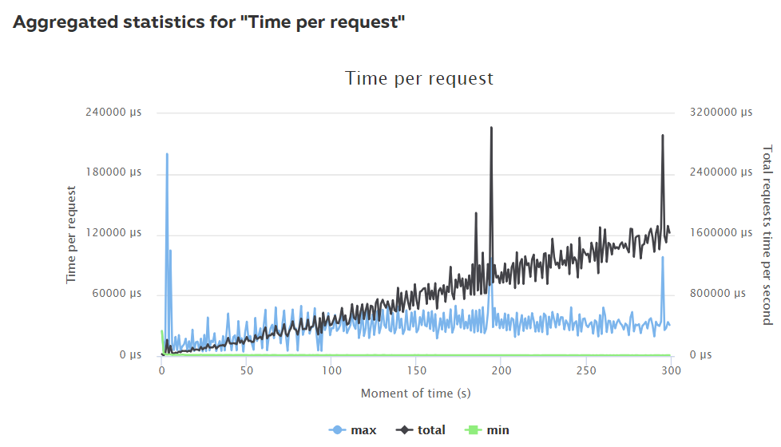
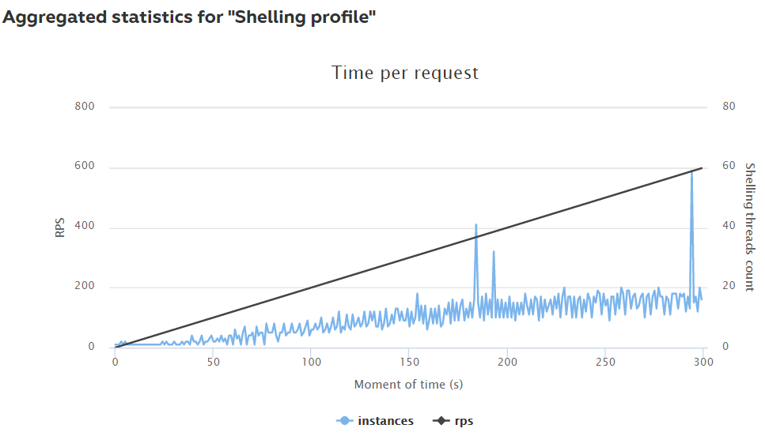
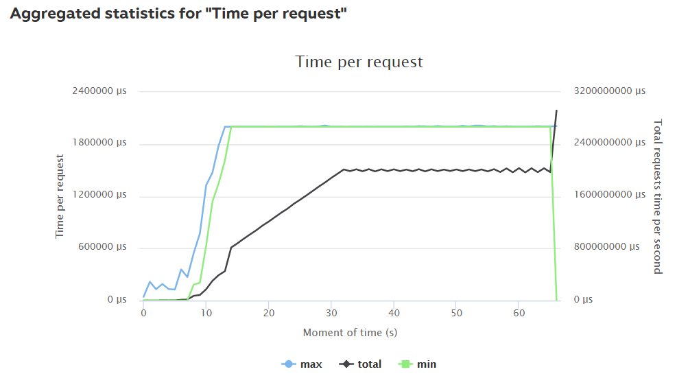
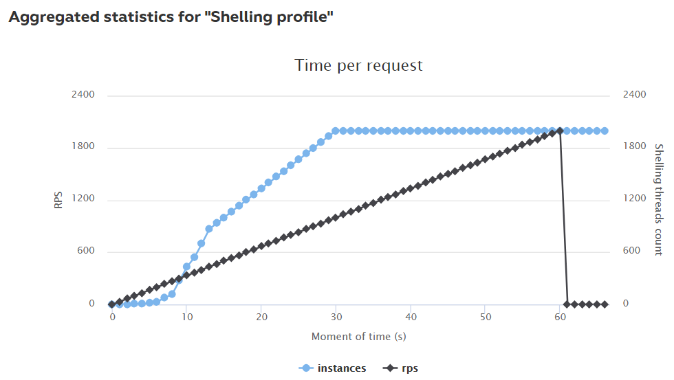

# Highload cup 2018
Implementation of json REST API for mail.ru [highload cup 2018](https://highloadcup.ru).

Dating service simulator, with fast search and people matching / grouping.
89th place with score of 137326 and 63.8% of correct answers (incorrect answers are response timeouts).
Testing was done in virtualized environment,
Intel Core i7, 4 cores 2.4 GHz, 2 Gb memory, 10 Gb disk space.
Raw testing data is 2 GB json unpacked.

Solution stores all data in-memory and doesn't use any external db.
Additional indexes are built for most frequently used fields.
Disk space provided is not used.

In order to fit into 2-second response limit, solution required to have
worst performance of 2 msec per request per core, so that 4 cores could
service 4 requests per 2 msec = 2000 rps peak load in 3rd phase.

Best performance archieved by this solution is 160 msec per response in the worst case,
which is obvously not enough to fit limits. Slowest parts are O(N) scans in
group-by and filter queries without criteria, which probably could be eliminated
by additional indexing, and garbage collection interrupts - solution is allocation-hungry.
Serialization and index lookups have insignificant cost compared to scanning.

## Statistics

* 1st phase GET:

* 2nd phase POST:

* 3rd phase GET:

